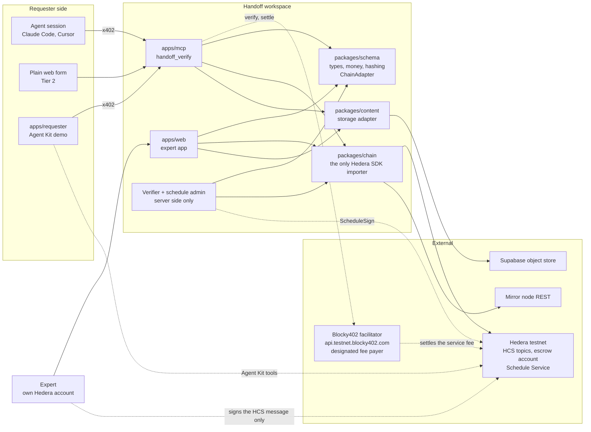
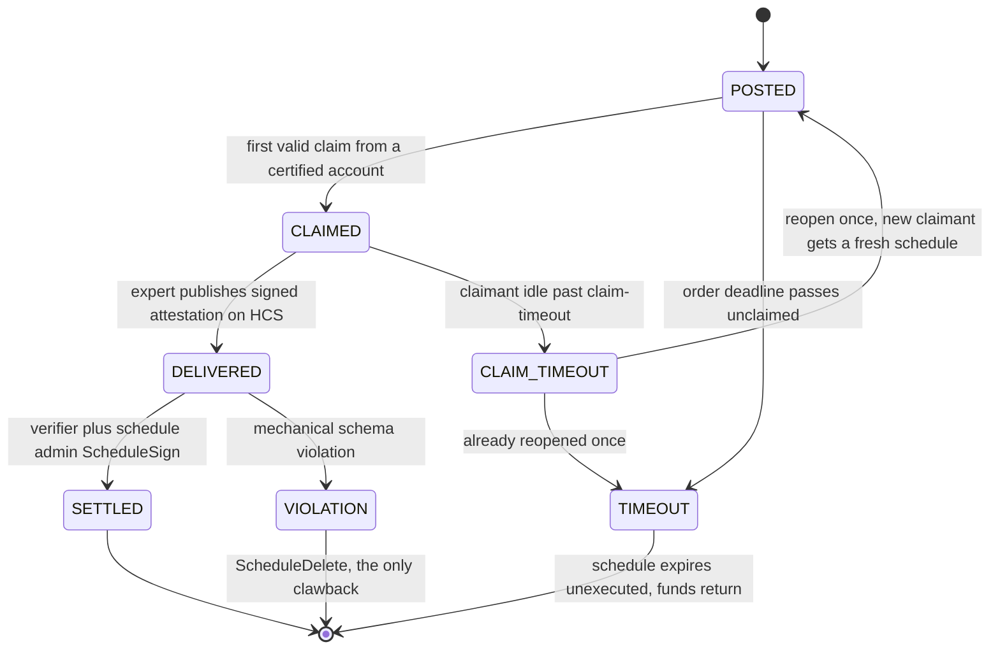
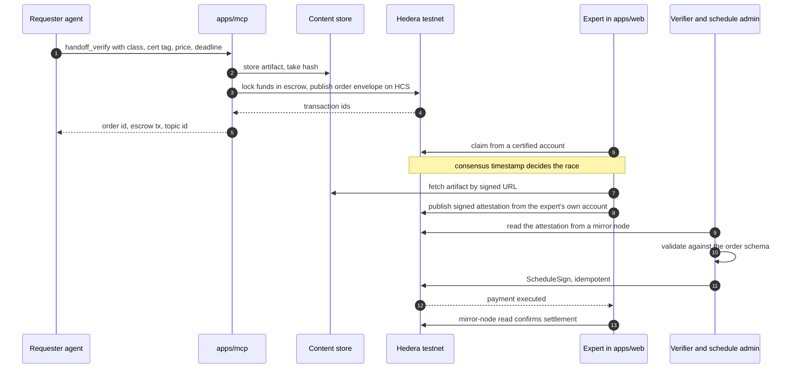
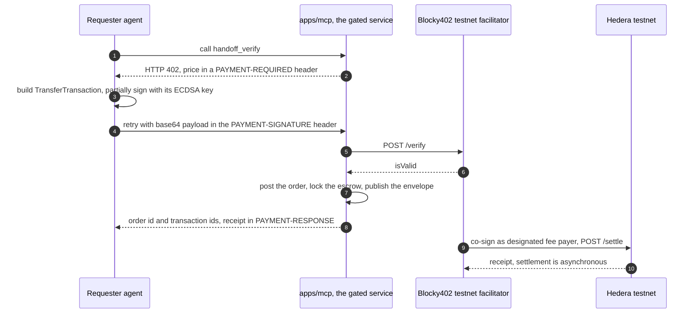
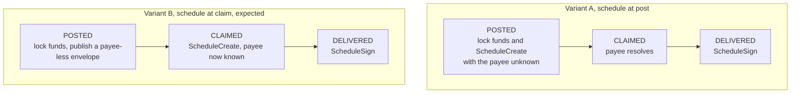

# Architecture

Mermaid in markdown so it is diffable and any session can regenerate it. **Keep this
current in the same pull request as the change it describes.** A diagram that disagrees
with the code is worse than no diagram.

Nothing here is settled beyond the brief. The one genuinely open shape is the schedule
timing, drawn at the bottom.

## Components

Two rules the picture encodes:

- Only `packages/chain` imports the Hedera SDK. Everything else goes through the
  `ChainAdapter` interface that `packages/schema` owns, which is what makes the
  mock-to-testnet cutover a one-line swap.
- The verifier and schedule-admin keys live in a server-side process only. Nothing with
  a browser build ever holds them.

## Order lifecycle

Three things this diagram is load-bearing for:

- **`CLAIM_TIMEOUT` and `TIMEOUT` are different events.** Claim-timeout is short relative
  to the order deadline, so a lazy claimant cannot hold funds hostage. Do not collapse
  them into one timer.
- **Consensus timestamp decides who won a claim.** The expert app may render a claim
  optimistically, but it has to handle losing the race when the mirror node confirms an
  earlier one.
- **`DELIVERED` to `SETTLED` is an idempotent retry.** If the verifier is asleep when the
  expert signs, the attestation still stands on HCS and payment lands on recovery. Never
  double-pay.

## Happy path

Hashes only cross the chain boundary. The artifact and the expert's written notes go to
the content store; only `artifact_hash_in` and `notes_hash` reach HCS.

## The x402 service gate

Distinct from the escrow, and the two must never be conflated. The service fee is a
micropayment for calling `handoff_verify`. The order value is the price of the judgment
and it goes to escrow.

The facilitator is the designated fee payer, so the client never pays gas and the client's
key never leaves the client. Facilitator base URL is `https://api.testnet.blocky402.com`
and the network identifier is `hedera:testnet`. The mainnet host is forbidden by hard
rule 5.

Three constraints the diagram does not show. The x402 signer must be an **ECDSA**
account. Payment is in **HBAR**, not USDC, because USDC on testnet needs a token
association on both accounts first. The x402 receiver is a **separate account** from the
escrow, never the escrow threshold key.

## Escrow quorum

Two of three on the escrow account.

| Key | Held by | Signs for |
|---|---|---|
| Requester session key | The requester | Clawback, with the platform |
| Platform verifier key | Us | Early execute, and clawback |
| Schedule admin key | Us | Early execute, and schedule deletion |

Early execute is verifier plus admin, after the attestation validates. Clawback is
requester plus platform, only after a mechanical schema failure.

**Admitted honestly:** the verifier key and the admin key are both ours this week, so a
compromised backend has quorum. Two Node processes on one team are not two custodians.
Decentralizing the verifier is the production roadmap.

## Open: when the schedule is created

P1's hour-one spike settles this. Hedera's Schedule Service normally wants a fully formed
inner transfer, so variant B is the expected outcome.

Under variant B the post-to-claim window is protected by the threshold key alone, which
is trusted-platform and gets admitted out loud. The demo narration then says "committed
at claim", not "committed at post".

Decide by the end of hour one, then update this file, the brief's lifecycle block, and
the narration together. Until it is decided, do not hard-code either shape.
